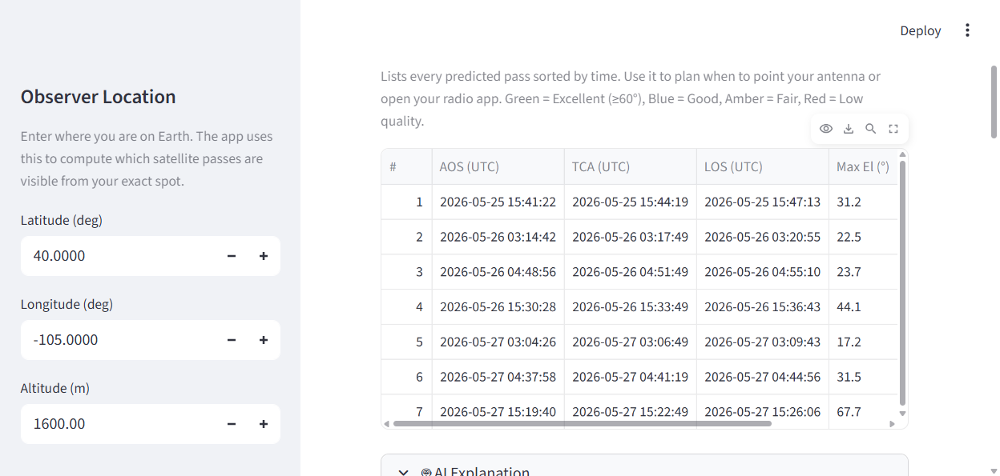
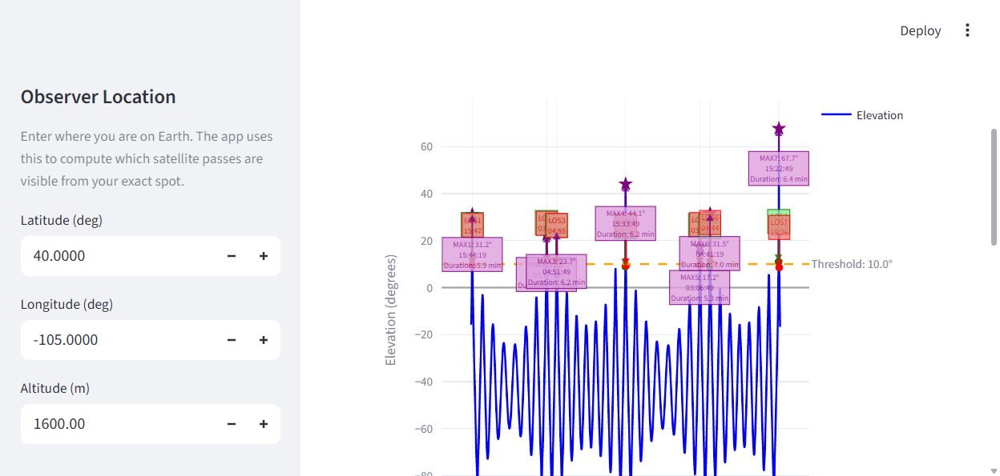
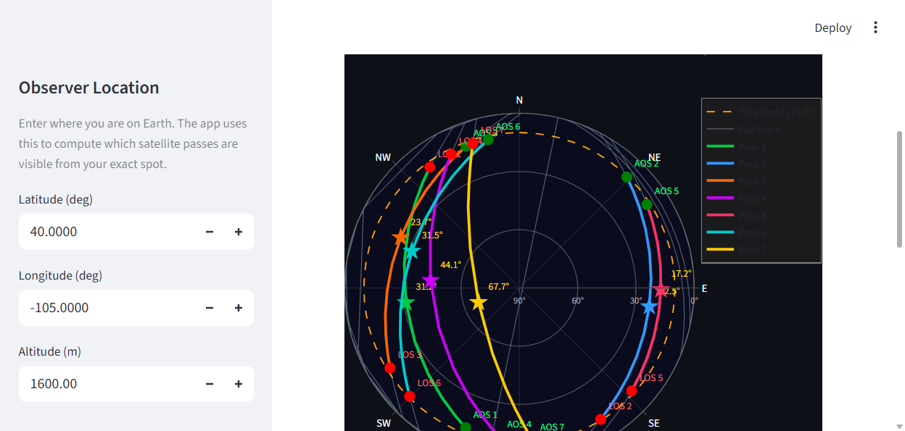
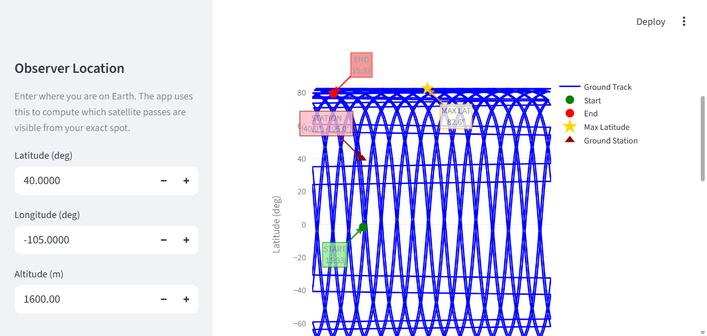
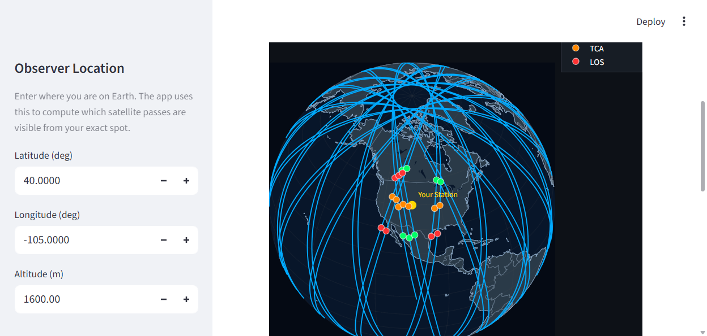

# Satellite Pass Predictor

**Predict when satellites are visible from your location** — an interactive Streamlit dashboard powered by SGP4 orbital mechanics, live TLE fetching, and AI-generated explanations via Groq.

Enter your ground station coordinates, a NORAD ID (or local TLE file), and a time window. The app predicts every pass (AOS → TCA → LOS), shows pass quality, and explains the results in plain English. Five visualization tabs give you every angle on the satellite's path.

---

## How It Works

1. **TLE ingestion** — A Two-Line Element set is fetched from CelesTrak/Space-Track or loaded from a local file. TLEs encode the satellite's orbit as a compact set of Keplerian + drag parameters.
2. **SGP4 propagation** — The SGP4/SDP4 model integrates the equations of motion at each time step, producing a position vector in the **TEME** (True Equator Mean Equinox) inertial frame.
3. **Coordinate transforms** — TEME is rotated to **ECEF** (Earth-Centered, Earth-Fixed) using the Greenwich Mean Sidereal Time angle, then converted to geodetic lat/lon/alt.
4. **Elevation computation** — The vector from the ground station to the satellite is projected into the local **topocentric** frame (South-East-Zenith). The elevation angle is the angle above the local horizon.
5. **Pass detection** — A sliding window scans the elevation time series for intervals where the angle exceeds the configured threshold. AOS, TCA (peak), and LOS events are recorded for each pass.
6. **ML correction** — A PyTorch residual network trained on historical SGP4 errors applies a learned correction to elevation estimates, improving accuracy on passes where systematic SGP4 drift is known to occur. Can be toggled on/off in the sidebar.
7. **Visualization & AI** — Plotly renders all charts client-side. When the AI toggle is on, pass data is summarised into a structured prompt and streamed through Groq's Llama 3.1 API.

---

## Screenshots

### Passes — sorted pass table with quality ratings



### Elevation — angle over time with annotated pass markers



### Sky View — polar view of the satellite arc across your sky dome



### Ground Track — 2D world map of the orbital footprint



### Globe — interactive 3D orthographic globe (fully offline, no tile server)



---

## Quick Start

```bash
pip install -r requirements.txt
streamlit run app.py
```

Open `http://localhost:8501`. Set your location, enter a NORAD ID, and click **Run Prediction**.

### Command Line (no UI)
```bash
python main.py --tle data/tle_leo/AO-91.txt --hours 48 --plot plotly
```

---

## Key Features

| Feature | Detail |
|---|---|
| **SGP4 propagation** | Industry-standard orbital mechanics (pysgp4) |
| **Live TLE fetching** | CelesTrak (no account) or Space-Track (free account) |
| **5 visualization tabs** | Passes, Elevation, Sky View, Ground Track, Globe |
| **AI explanations** | Auto-streamed Groq/Llama commentary per tab |
| **ML corrections** | Optional PyTorch residual error reduction layer |
| **CLI support** | Scriptable command-line interface |

---

## Setup for AI Explanations (optional)

Create a `.env` file:
```
GROQ_API_KEY=your_key_here
```
Get a free key at [console.groq.com](https://console.groq.com). Without it the explanation toggle simply has nothing to show.

## Setup for Space-Track (optional)

```
SPACETRACK_USER=your_email@example.com
SPACETRACK_PASS=your_password
```
CelesTrak works without any account.

---

## Popular NORAD IDs

| Satellite | NORAD ID |
|---|---|
| ISS | 25544 |
| AO-91 (Fox-1B) | 43017 |
| AO-95 (Fox-1Cliff) | 43770 |
| Hubble Space Telescope | 20580 |
| NOAA-19 | 33591 |

---

## Technology Stack

| Component | Library | Purpose |
|---|---|---|
| Orbital mechanics | sgp4 | Predict satellite positions from TLE |
| Dashboard | Streamlit | Interactive browser UI |
| Charts | Plotly | Elevation, sky polar, ground track, globe |
| AI explanations | Groq + Llama 3.1 | Natural-language pass summaries |
| ML corrections | PyTorch | Optional neural network residual layer |
| Testing | Pytest | Automated test suite |

---

## Project Structure

```
satellite-project/
├── app.py                      Streamlit dashboard entry point
├── main.py                     CLI entry point
├── src/
│   ├── core/                   Physics engine (SGP4, coordinates, TLE fetcher)
│   ├── visualization/          Elevation, ground track, sky polar, globe (Plotly)
│   ├── ml/                     Neural network residual correction
│   └── llm_explainer.py        Groq streaming AI explanation builder
├── data/
│   ├── tle_leo/                Local LEO TLEs (AO-91, AO-95)
│   └── tle_geo/                Local GEO TLEs
├── models/                     Pre-trained ML model weights
├── outputs/                    Generated JSON pass reports (git-ignored)
├── docs/                       Technical documentation and screenshots
└── tests/                      Automated test suite
```

---

## Accuracy Notes

- Use TLEs less than 14 days old for reliable predictions
- GMST rotation used without polar motion correction (suitable for most amateur use cases)
- No terrain or atmospheric obstruction modeling
- For high-precision work, consider Astropy or NASA SPICE

## Data Sources

- [CelesTrak](https://celestrak.org/) — Free, no account required
- [Space-Track](https://www.space-track.org/) — Full catalog, free account required

---

## Documentation

- [Architecture](docs/ARCHITECTURE.md) — Module design and data flow
- [Prediction Pipeline](docs/deep_dive/prediction_pipeline.md) — SGP4 math, coordinate transforms, ML corrections
- [FAQ](docs/FAQ.md) — Physics, data sources, ML, and testing questions
- [Development Guide](docs/DEVELOPMENT.md) — Contributing, testing, code style
- [Roadmap](docs/ROADMAP.md) — Planned features

## Contributing

See [DEVELOPMENT.md](docs/DEVELOPMENT.md) for setup, testing, and code style guidelines.

